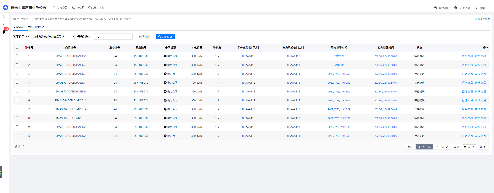

### [磋商平台项目接口文档](#)
`版本号：1.0.0`

-----

- [`1. HTTP状态码说明`](#1-HTTP状态码说明)
- [`2. 用户管理接口`](#2-用户管理接口)
- [`3. 需求管理接口`](3-需求管理接口)
- [`4. 通知管理接口`](#4-通知管理接口)
- [`5. 交易管理接口`](#5-交易管理接口)


-----

#### [1. HTTP状态码说明](#)
项目前后端使用HTTP协议，HTTP状态码是用于说明从后端返回的HTTP Response报文状态的基本设置。常用的状态码如200，表示请求正常（成功）, 服务器已成功处理了请求。
404，表示（未找到）服务器找不到请求的路径，500：（服务器内部错误）服务器遇到错误，无法完成请求。我们对前后端HTTP状态码约定如下：

`200-300 [2xx]`:表示请求正常接收，服务器成功接收请求，并且正常处理。  
`300-400 [3xx]`:表示要完成请求，需要进一步操作。通常，这些状态代码用来重定向。本系统设计并未考虑3XX端口使用。不做考虑
`400-500 [4xx]`:表示客户端请求错误，例如请求参数数值不属于正常范围，ID已经存在，账号密码错误。同时，后端仍然后返回一个JSON 信息。表示错误原因。服务器对所有的4XX系状态码都只返回一个只
带一个message字段用于表示错误原因的HTTP响应报文。例如：

```json
{
    "message": "账号或密码错误"
}
```

`500-5XX [5xx]`:（服务器错误）这些状态代码表示服务器在尝试处理请求时发生内部错误。这些错误可能是服务器本身的错误，而不是请求出错。这种状态下不返回任何JSON。前端根据状态号表示为
服务器内部错误。

**请勿使用code代替HTTP状态码，示范如下：**
```js
{
    code: 401,
    message: "请求体格式不正确！"
}
```


#### [2. 用户管理接口](#)
对用户的管理有登陆接口，修改密码的接口，注销账户的接口

##### [2.1 /subscriber/login](#)

| `接口名称`     | `路由`              | `Method 方法` | `正确状态码` | `错误状态码` | `说明`     |
| :------------- | :------------------ | :------------ | :----------- | :----------- | :--------- |
| `用户登录接口` | `/subscriber/login` | `POST`        | `200`        | `417`        | `用户登录` |

`请求参数`:

```javascript
{
    useId: 'admin', /* 备注：账户，对应的是ca证书的账户 */
    userPwd: '123456' /* 备注：密码，对应的是ca证书的密码 */
}
```

`正确返回参数 http状态码 200`

```javascript
{
    isOK: true,
    token:"ASD4A-GHJY5-ASDA5-UISB6"		
}
```

`错误返回参数 http状态码 417`

```javascript
{
    message: "错误原因" //例如 你的账户或密码不正确
}
```

##### [2.2 /subscriber/logout](#)

`用户注销接口`

| `接口名称` | `路由`               | `Method 方法` | `正确状态码` | `错误状态码` | `说明`         |
| :--------- | :------------------- | :------------ | :----------- | :----------- | :------------- |
| `用户注销` | `/subscriber/logout` | `POST`        | `200`        | `417`        | `注销当前账户` |

`请求参数`:

```javascript
{
	token:"ASD4A-GHJY5-ASDA5-UISB6"		
}
```

`正确返回参数 http状态码 200`

```javascript
{
    isOK: true
}
```

`错误返回参数 http状态码 417`

```javascript
{
    message: "错误原因" 
}
```

#####  [2.3 /subscriber/alter](#)

`修改用户密码`

| `接口名称` | `路由`              | `Method 方法` | `正确状态码` | `错误状态码` | `说明`      |
| :--------- | :------------------ | :------------ | :----------- | :----------- | :---------- |
| `密码修改` | `/subscriber/alter` | `POST`        | `200`        | `417`        | `可以修改?` |

`请求参数`:

```javascript
{ 
    oldPassword: "oldPwd", 
    newPassword: "onePwd"
}
```

`正确返回参数 http状态码 200`

```javascript
{
    isOK: true
}
```

`错误返回参数`

```javascript
{
    message: "错误原因" 
}
```


##### [2.4 /direction/waiting](#)

`需求当前待执行的指令！`

| `接口名称`                   | `路由`               | `Method 方法` | `正确状态码` | `错误状态码`                             | `说明` |
| :--------------------------- | :------------------- | :------------ | :----------- | :--------------------------------------- | :----- |
| `需求当前待执行的指令列表！` | `/direction/waiting` | `GET`         | `200`        | `应该只会服务器错误，或者用户未登陆错误` | `....` |

`请求参数 无请求参数` :

```javascript
/* 无请求参数 */
```

`正确返回参数 http状态码 200`

```javascript
{
    length:4,
	data:[
        {
            index: 124,
            carryOutTime: "2022/07/09 14:00:00",
            codeName: "削峰指令ADVQ27353123",
            coin: "36",
            createTime: "2021/10/8 14:41:12",
            detail: "为保证核心单位[学校，食品生成,医疗单位...]....！",
            endTime: "2022/10/19 14:00:00",
            mark: "优秀",
            phone: "17754986258",
            principalName: "李越",
            rate: 7.2,
            states: "执行完毕",
            type: "削峰",
            valueElectric: 500
        },
        /*{...},{...},{...},{...},{...},{...}*/
    ]
}
```

`错误返回参数`

```javascript
{
	message: "错误原因" 
}
```


##### [2.5. /subscriber/assets](#)

`用户资产`

| `接口名称` | `路由`               | `Method 方法` | `正确状态码` | `错误状态码` | `说明` |
| :--------- | :------------------- | :------------ | :----------- | :----------- | :----- |
| `用户资产` | `/subscriber/assets` | `GET`         | `200`        | `417`        | `....` |

`请求参数 `  : `无`

`正确返回参数`: `200`

```javascript
{
      id:2,
      codeId:'AAAA112',
      address:"上海市浦东新区浦东南路1888号浦东大酒店",
      points:125, //总积分
      freezingPoints:25, //冻结积分
      availablePoints:100, // 可用积分
      reputation:60, //信誉分
      electricityToBeExecuted:1500, //待执行电荷量
      electricityUnit: 'kw.h', //电荷 单位
      states:"在线", //节点状态 无所谓你返回或者不返回 i don't care about
      phone:"028-85264432" //电话
}
```

`错误返回参数`:`417`

```javascript
{
    message: '你的token 已经过期，无法加载个人信息！'
}
```

`错误返回参数`:`500` `500为服务器错误！ `


#### [3. 需求管理接口](#)


##### [! important 枚举约定](#)

`1. requirementType 需求类型`

```
RequirementTypes: [
	{name:'全部类型', value: -1},
	{name:"可协商", value: 1}, 
	{name:"不可协商", value: 2}
]
```

`2. TransactionTypes 交易类型`

```
TransactionTypes:[
    {name:'全部类型', value: -1},
    {name:'电力交易', value: 1},
    {name: '积分交易', value: 2}
]
```

`3. TransactionStates 交易状态`

```
TransactionStates:[
    {name:'全部类型', value: -1},
    {name:'正常', value: 1},
    {name: '已取消', value: 2},
    {name: '已拒绝', value: 3}
]
```


包括如下发布需求,撤销需求，需求商场分页查询接口，需求历史分页查询接口！

##### [3.1 /trade/electric](#)

`发布电力交易需求`

| `接口名称`         | `路由`            | `Method 方法` | `正确状态码` | `错误状态码` | `说明`           |
| :----------------- | :---------------- | :------------ | :----------- | :----------- | :--------------- |
| `电力交易需求接口` | `/trade/electric` | `POST`        | `200`        | `417`        | `有重多参数约束` |

`请求参数`:

```javascript
{
  directionID: '126', /* 指令编号  主键 */
  isCanConsult: false, /* 是否可以协商 */
  electric: '1000', /* 需要别人承担的电荷量 单位是 kw.h */
  credit: '20', /* 抵押积分 我知道应该是 point 但是没法改了  */
  point:'20' /* 为了方便你 映射 credit 你们可以当没看见 credit 和 point 是一样的值 */
}
```

`正确返回参数 http状态码 200`

```javascript
{
    isOK: true
}
```

`错误返回参数`

```javascript
{
    message: "错误原因" 
}
```

**约束:**

1. `用户身份信息通过 header里面的 token 获取`

2. `创建时间以服务器获取请求时间为准`

3. `截止以指令开始执行时间一个小时为准`

4. `产生的是一个电力交易需求  --- 甲方给出 积分 乙方给出 电荷`

   

##### [3.2 /trade/credit](#)

`发布积分交易需求`

| `接口名称`         | `路由`          | `Method 方法` | `正确状态码` | `错误状态码` | `说明`     |
| :----------------- | :-------------- | :------------ | :----------- | :----------- | :--------- |
| `发布积分交易需求` | `/trade/credit` | `POST`        | `200`        | `417`        | `积分需求` |

`请求参数`:

```javascript
{
  directionID: '126', /* 指令编号  主键 */
  isCanConsult: false, /* 是否可以协商 */
  electric: '1000', /* 需要别人承担的电荷量 单位是 kw.h */
  credit: '20', /* 抵押积分 我知道应该是 point 但是没法改了  */
  point:'20' /* 为了方便你 映射 credit 你们可以当没看见 credit 和 point 是一样的值 */
}
```

`正确返回参数 http状态码 200`

```javascript
{ 
    isOK: true
}
```

`错误返回参数`

```javascript
{
    message: "错误原因" 
}
```

**约束:**

1. `用户身份信息通过 header里面的 token 获取`
2. `创建时间以服务器获取请求时间为准`
3. `截止以指令开始执行时间一个小时为准`
4. `产生的是一个积分交易需求  --- 甲方给出 电荷 乙方给出 积分`


##### [3.3 /requirement/revoke](#)

`撤销尚未产生任何交易的需求信息`

| `接口名称`     | `路由`                | `Method 方法` | `正确状态码` | `错误状态码` | `说明` |
| :------------- | :-------------------- | :------------ | :----------- | :----------- | :----- |
| `插销需求接口` | `/requirement/revoke` | `delete`      | `200`        | `417`        | `....` |

`请求参数`:

```javascript
{ 
    requirementId: 1
}
```

`正确返回参数`

```javascript
{
    isOk: true
}
```

`错误返回参数`

```javascript
{
    message: '无法撤销，该需求已经产生了的交易！'
}
```


**约束:**

1. `如果当前需求下没有任何交易才可以撤销`
2. `需求下有交易，但全部交易都是拒绝状态才可以撤销`
3. `撤销只需要设置状态就可以，不是删除需求`

##### [3.4 /requirement/requirements](#)
需求历史分页接口

|`接口名称`|`路由`|`Method 方法`|`正确状态码`|`错误状态码`|`说明`|
|:---|:---|:---|:---|:---|:---|
|`需求历史分页接口`|`/requirement/requirements`|`POST`|`200`|`417`|`可以查询所有状态的需求`|

`请求参数`:

```javascript
{
  requirementId: -1, /* 需求编号 如果是 -1 那么默认查询所有需求 */
  directionId: -1, /* 如果是 -1 那么默认查询所有需求 */
  isOnlyMe: false, /* true 只查询当前用户发布的需求 false 查询所有需求 */
  requirementType: -1, /* 需求类型 
     {name:'全部类型', value: -1},{name:"可协商", value: 1}, {name:"不可协商", value: 2} 
  */
  transactionType: -1, /* 交易类型 
    {name:'全部类型', value: -1},{name:'电力交易', value: 1},{name: '积分交易', value: 2} 
  */
  sortTime: 1, /* 降序 v:1 升序 v:0 */
  pageIndex: 1, /* 第几页 从 1 开始 */
  count: 10 /*每页有几条消息*/
}
```
`正确返回参数`

```javascript
{
    data:[{
            cmdId: 123
            codeId: "1SHKUSDKL"
            electricUnit: "kw.h"
            electricValue: 1000
            endDateTime: "2022/7/25 12:00:00"
            leftElectricValue: 1000
            leftPoint: 4
            partyA: 1
            partyACode: "AA111"
            point: 5.8
            publishDateTime: "2022/7/20 12:00:00"
            requirementId: 1
            requirementType: 1
            state: 1
            transactionType: 2
        }, /*{…}, {…}, {…}, {…}, {…}, {…}, {…}, {…}, {…}*/]
    pageCount: 2, /* 总页数 */
    total: 13 /* 当前搜索条件下 有多少条数据 */
}
```


##### [3.5 /trade/market](#)

`查询需求发布`

| `接口名称` | `路由`          | `Method 方法` | `正确状态码` | `错误状态码`             | `说明`                         |
| :--------- | :-------------- | :------------ | :----------- | :----------------------- | :----------------------------- |
| `交易市场` | `/trade/market` | `POST`        | `200`        | `417` `可能会有参数错误` | `只查询未撤销且当前有效的需求` |


`请求参数`:

```javascript
{
  	transactionType: -1, /* 产生交易类型 */
  	directionId: -1,/* 所属执行ID */
  	requirementType: -1, /* 需求类型 可协商 or 不可协商 */
  	timeSort: 1,/* 降序 v:1 升序 v:0 */
  	priceSort: 1,/* 降序 v:1 升序 v:0 */
  	pointSort: 1,/* 降序 v:1 升序 v:0 */
  	electricSort: 1,/* 降序 v:1 升序 v:0 */
  	isOnlyMe: false, //只查看我的交易
    requirementCodeId:'564651654a6s5d4a23sd1as65d4asd',
  	pageIndex: 1, //第几页
  	count: 7 /* 每一页几条数据 */
}
```

`正确返回参数`

```javascript
{
        total:23, //有多少条数据
        data:[
			{
                requirementId: 2,
                codeId:'2SHKUSDKL',
                requirementType:2,	//enum 1,2	1 可以协商 2 不可以协商
                transactionType:2,	//enum 3,2	3 电力交易 2 积分交易
                cmdId:123,	//long int forigen key	指令ID
                endDateTime: '2022/7/25 12:00:00', //datetime	需求有效截止时间 时间格式 2022/5/15 12:50:12
                publishDateTime: '2022/7/20 12:00:00', //	datetime	发起时间 时间格式 2022/5/15 12:50:12
                partyA:2	,//用户表_ID 外键	合同的甲方
                partyACode:'AA112', //用户表 编号	合同的甲方编号
                electricValue: 1000,//	decimal	电荷量
                point:7.5,//	decimal	积分
                electricUnit:'kw.h',	//varchar	单位
                state: 1,	//enum	状态 1 未撤销 2 撤销
                leftElectricValue:1000,	//decimal	剩余电荷
                leftPoint: 7.5	//decimal	剩余积分
            }, //{...},{...},{...},{...}
        ],
        pageCount
}
```

`错误返回参数`

```javascript
{    
    message:"错误原因"
}
```


##### [3.6 /requirement/yours](#)

`获取当前用户自己发布的还有效的尚未撤销的需求信息`

| `接口名称` | `路由`               | `Method 方法` | `正确状态码` | `错误状态码` | `说明`             |
| :--------- | :------------------- | :------------ | :----------- | :----------- | :----------------- |
| `需求获取` | `/requirement/yours` | `GET`         | `200`        | `417`        | `queryString 参数` |


`请求参数`: 

```javascript
{
	Type: 1
    /*  产生的交易是什么类型的：
        {name: '电力交易', value: 1},
        {name: '积分交易', value: 2}
    */
}
```


`正确返回参数`

```javascript
{
    "total": 13,
    "data": [
        {
            "requirementId": 1,
            "codeId": "1SHKUSDKL"
        },
		/* .... */
        {
            "requirementId": 13,
            "codeId": "13SHKUSDKL"
        }
    ]
}
```

`错误返回参数`

```javascript
{
    message:"错误原因"
}
```


##### [3.7 /requirement/others](#)

`获取并非当前用户自己发布的还有效的尚未撤销的需求信息`

| `接口名称` | `路由`                | `Method 方法` | `正确状态码` | `错误状态码` | `说明` |
| :--------- | :-------------------- | :------------ | :----------- | :----------- | :----- |
| `需求获取` | `/requirement/others` | `GET`         | `200`        | `417`        | `...`  |


`请求参数`: 

```javascript
{
	Type: 1
    /*  产生的交易是什么类型的：
        {name: '电力交易', value: 1},
        {name: '积分交易', value: 2}
    */
}
```

`正确返回参数`

```javascript
{
    "total": 13,
    "data": [
        {
            "requirementId": 1,
            "codeId": "1SHKUSDKL"
        },
		/* .... */
        {
            "requirementId": 13,
            "codeId": "13SHKUSDKL"
        }
    ]
}
```

`错误返回参数`

```javascript
{
    message:"错误原因"
}
```


#### [4. 通知管理接口](#)

包括如下通知历史，查询当前未查看通知，关闭单个通知，清除所有通知

#####  [!important 枚举约定](#)

`1. 通知的类型`

```
notificationTypes: [
     {name:'全部类型', value: -1},
     {name:"收到积分合同请求", value: 1},
     {name:"收到电力合同请求", value: 2},
     {name:"新的交易需求", value: 3},
     {name:"电力合同被拒绝", value: 4},
     {name:"积分合同被拒绝", value: 5}
]
```


##### [4.1 /notice/waiting](#)

`解释说明`

| `接口名称`             | `路由`            | `Method 方法` | `正确状态码` | `错误状态码`         | `说明`                       |
| :--------------------- | :---------------- | :------------ | :----------- | :------------------- | :--------------------------- |
| `当前用户未查看的通知` | `/notice/waiting` | `GET`         | `200`        | `只会服务器报错 500` | `是自己的通知，接受者是自己` |

`请求参数`:`无`

`正确返回参数`

```javascript
{
   notifications:[
       {
            notificationId: 2,
            message: "有人发不了新的交易需求 [需求：电荷]",
            notificationType: 1,
            //通知类型 1 有人向你发起积分合同 2 有人向你发起了电力合同 3 新的交易需求 4 电力合同拒绝信息 5.积分合同拒绝信息
            publishDateTime: "2022/7/18 20:20:20",
            recipientCode: "AAA113",
            senderCode: "AAA111",
            state: 2
       },//{...},{...}，{...}，{...}
   ],
   count: 15 //几个通知
}
```


##### [4.2 /notices/notifications](#)

`自己的通知历史消息`

| `接口名称`     | `路由`                   | `Method 方法` | `正确状态码` | `错误状态码` | `说明`         |
| :------------- | :----------------------- | :------------ | :----------- | :----------- | :------------- |
| `通知历史接口` | `/notices/notifications` | `POST`        | `200`        | `417`        | `只看自己的哦` |

`请求参数`:

```javascript
{ 
    notificationType: -1, 
    //1 有人向你发起积分合同 2 有人向你发起了电力合同 3 新的交易需求 4 电力合同拒绝信息 5.积分合同拒绝信息
    pageIndex: 1, //第几页
    count: 10,//每页几条数据
    sortTime: 1 /* 降序 v:1 升序 v:0 */
}
```

`正确返回参数 200`

```javascript
{
    total: 25,//总共有多少条
    data:[
        notificationId:1,
        senderCode: 'AAA111'	,
        recipientCode:'AAA112'	,
        message:"有人发出了新的交易需求"	,
        notificationTypeName:'新的交易需求', //把 notificationType 映射为 具体类型名称
        state:	2,
        publishDateTime:'2022/7/18 20:20:20'	
    ],
    pageCount:2 //有几页
}
```

`错误返回参数 417`

```javascript
{
    message:"错误原因"
}
```

##### [4.3 /notice/delete](#)

`解释说明`

| `接口名称` | `路由`            | `Method 方法` | `正确状态码` | `错误状态码` | `说明` |
| :--------- | :---------------- | :------------ | :----------- | :----------- | :----- |
| `删除通知` | ` /notice/delete` | `DELETE`      | `200`        | `417`        | `....` |


`请求参数`:

```javascript
{ 
    deleteType: "Single", 
    // Single 将一个通知设置为已查看
    // All 将所有通知设置为已查看
    notificationId: 4 //唯一表示一个通知 
}  
```

`正确返回参数`

```javascript
{
    isOK: true
}
```

`错误返回参数`

```javascript
{
    message:"当前通知已经被删除了"
}
```

**约束:**

1. `需要判断当前Id对应的通知是不是当前用户的`
2. `如果 deleteType == All 那么 notificationId 参数是无意义的，前端将置其为 -1`


#### [5. 交易管理接口](#)

包括了交易历史，出价购买，撤销，检索....


#####  [!important 枚举约定](#)

`1. 交易的状态 transaction.state`

```
state: [
     {name:"等待甲方确认", value: 1},
     {name:"已取消", value: 2},
     {name:"被拒绝", value: 3}
]
```


##### [5.1 /transaction/transactions](#)

`交易历史`

| `接口名称`     | `路由`                      | `Method 方法` | `正确状态码` | `错误状态码` | `说明`           |
| :------------- | :-------------------------- | :------------ | :----------- | :----------- | :--------------- |
| `交易历史信息` | `/transaction/transactions` | `POST`        | `200`        | `417`        | `检索所有的交易` |


`请求参数`:

```javascript
{
      cmdId: '',//指令ID 默认为 空 就是查询所有
      requirementCodeId: '',//需求编号
      transactionType: -1, //交易类型
      pageIndex: 1,
      count: 10,
      transactionCodeId: '',//交易编号 用户检索具体 某一个交易
      transactionState: -1,//交易状态
      isOnlyMe: false, //只查看我的
      partyACode: '', //甲方 CodeId
      partyBCode: '',//乙方 CodeId
      sortTime: 1  /* 降序 v:1 升序 v:0 */
}
```

`正确返回参数`

```javascript
{
    total:transactions.length,
    data:[
        {
            transactionId:1 , //bigint or int 自增类型 数据库主键 pk	唯一标识一个交易
            codeId: 'SIMASSDSDSLDIANSD2'
            cmdId: 123, //index 指令表主键	标识交易所属指令
            electricityValue:300, //decimal	电荷量
            requirementId:1 ,//外键 所属需求	标书交易所属需求，需求指向一个指令
            electricityUnit:"kw.h",	//enum string 可能取值: kw.h	用电量单位
            point:1.5,	//decimal	积分量
            partyA:	12,//用户表_ID 外键	合同的甲方
            partyB:13	,//用户表_ID 外键	合同的乙方
            partyACode: 'AAA112'	,//用户表 编号	合同的甲方编号
            partyBCode:'AAA113'	,//用户表 编号	合同的乙方编号
            type:3	,//enum 合同类型	电力合同 / 积分合同
            addTime:'2022/7/22/ 19:58:09'	 ,//datetime	合同创建时间
            partyASubscribe: '2022/7/23/ 19:58:09' ,//datetime	甲方签署时间
            partyBSubscribe: '2022/7/22/ 19:58:09',//datetime	乙方签署时间
            endTime:'2022/7/25 12:00:00'	,//datetime	签署截止时间
            expirationTime:	'2022/7/25 12:00:00',//datetime	指令结束时间 就是交易过期时间
            partyASignature:'2bf69aea77b14a16a7678e1b1ae4be31ed....',//string	签名
            partyBSignature:'6f1ce3544c919613d7f0cd47f18abdd8f7....',//string	签名
            directionStartTime:'2022/7/25/ 12:00:00'	,//datetime	指令开始执行时间
            directionEndTime:'2022/7/26/ 12:00:00'	,//datetime	指令结束执行时间
            state:3	,//enum 1 正常 2 已取消	甲方没有签署之前，是可以撤销的
            requirementCodeId: '1SHKUSDKL'
        },
        //{...},{...},{...},{...},....
    ],
    pageCount
}
```

`错误返回参数`

```javascript
{
    message:"错误原因"
}
```


##### [5.2 /trade/purchase](#)

`出价购买接口`

| `接口名称`     | `路由`            | `Method 方法` | `正确状态码` | `错误状态码` | `说明`                           |
| :------------- | :---------------- | :------------ | :----------- | :----------- | :------------------------------- |
| `出价购买接口` | `/trade/purchase` | `POST`        | `200`        | `417`        | `交易类型 通过requirementId判断` |


`请求参数`:

```javascript
{ 
    requirementId: 3, //需求 ID
    electricValue: '100', // 电荷量
    point: '0.75' //如果是不可协商交易 这个值无意义
}
```

`正确返回参数`

```javascript
{
    isOK: true
}
```

`错误返回参数`

```javascript
{
    message:"当前通知已经被删除了"
}
```


##### [5.2  /transaction/erequest - 已修改](#)

`electricity request 请求电力热交易 简写为 erequest`

`修改了正确返回参数，新增， partyAAddress partyBAddress 表示地址的字段, directionCreateTime 指令创建时间， directionType 指令类型`   `------------`  `2022/7/26 10:40 修改记录`

| `接口名称` | `路由`                   | `Method 方法` | `正确状态码` | `错误状态码` | `说明` |
| :--------- | :----------------------- | :------------ | :----------- | :----------- | :----- |
| `11111`    | ` /transaction/erequest` | `POST`        | `200`        | `417`        | `....` |


**说明**:`请求的数据是别人发给自己的交易请求，自己只需要决定是 拒绝 / 同意！ 也就说这交易是甲方是当前用户，而且这笔交易尚未签署！尚未过期，等待甲方确认！`



`请求参数`:

```javascript
{ 
    count: '10', //第几页
    pageIndex: 1, //第几页
    requirementId: '1', //需求主键 ID 值为 -1 表示查询所有需求
    sortTime: 1  /* 降序 v:1 升序 v:0 */
}
```

`正确返回参数`

```javascript
{
 	data:[
        {
            transactionId:1 , //bigint or int 自增类型 数据库主键 pk	唯一标识一个交易
            codeId: 'SIMASSDSDSLDIANSD2'
            cmdId: 123, //index 指令表主键	标识交易所属指令
            electricityValue:300, //decimal	电荷量
            requirementId:1 ,//外键 所属需求	标书交易所属需求，需求指向一个指令
            electricityUnit:"kw.h",	//enum string 可能取值: kw.h	用电量单位
            point:1.5,	//decimal	积分量
            partyA:	12,//用户表_ID 外键	合同的甲方
            partyB:13	,//用户表_ID 外键	合同的乙方
            partyAAddress:'上海市浦东新区年家浜路518号万达广场',//甲方地址
            partyBAddress:'上海市浦东新区浦东南路1888号浦东大酒店',//乙方地址
            partyACode: 'AAA112'	,//用户表 编号	合同的甲方编号
            partyBCode:'AAA113'	,//用户表 编号	合同的乙方编号
            type:3	,//enum 合同类型	电力合同 / 积分合同
            addTime:'2022/7/22/ 19:58:09'	 ,//datetime	合同创建时间
            partyASubscribe: '2022/7/23/ 19:58:09' ,//datetime	甲方签署时间
            partyBSubscribe: '2022/7/22/ 19:58:09',//datetime	乙方签署时间
            endTime:'2022/7/25 12:00:00'	,//datetime	签署截止时间
            expirationTime:	'2022/7/25 12:00:00',//datetime	指令结束时间 就是交易过期时间
            partyASignature:'2bf69aea77b14a16a7678e1b1ae4be31ed....',//string	签名
            partyBSignature:'6f1ce3544c919613d7f0cd47f18abdd8f7....',//string	签名
            directionStartTime:'2022/7/25/ 12:00:00'	,//datetime	指令开始执行时间
            directionEndTime:'2022/7/26/ 12:00:00'	,//datetime	指令结束执行时间
            directionCreateTime:'2022/7/22/ 12:00:00', //指令创建时间
            directionType:'削峰',//指令类型 削峰 其他...
            state:3	,//enum 1 正常 2 已取消	甲方没有签署之前，是可以撤销的
            reason:"被拒绝原因"
        }, 
    //{…}, {…}, {…}, {…}, {…}, {…}, {…}, {…}, {…}]
    pageCount: 3
    total: 21
}
```

`错误返回参数`

```javascript
{
    message:"当前通知已经被删除了"
}
```


`检索甲方为自己且当前有效的甲方未签署的且未撤销的交易`


##### [5.4  /transaction/refuse](#)

`拒绝一笔交易`

| `接口名称`     | `路由`                | `Method 方法` | `正确状态码` | `错误状态码` | `说明` |
| :------------- | :-------------------- | :------------ | :----------- | :----------- | :----- |
| `电力交易拒绝` | `/transaction/refuse` | `POST`        | `200`        | `417`        | `....` |


`请求参数`:

```javascript
{
	transactionId:'12', //交易ID	
    reason: 'asdasd' //拒绝原因
}
```

`正确返回参数`

```javascript
{
    isOK: true
}
```

`错误返回参数`

```javascript
{
    message:"当前交易已经被删除了" //例子
}
```


##### [5.5  /transaction/agree](#)

`甲方签署一笔电力交易`

| `接口名称`         | `路由`               | `Method 方法` | `正确状态码` | `错误状态码` | `说明` |
| :----------------- | :------------------- | :------------ | :----------- | :----------- | :----- |
| `签署一笔电力交易` | `/transaction/agree` | `POST`        | `200`        | `417`        | `....` |


`请求参数`:

```javascript
{
	transactionId:'12' //交易ID	
}
```

`正确返回参数`

```javascript
{
    isOK: true
}
```

`错误返回参数`

```javascript
{
    message:"当前交易已经签署完成了" //例子
}
```


##### [5.6  /transaction/cancel](#)

`乙方取消一笔自己发出的交易`

| `接口名称`         | `路由`                | `Method 方法` | `正确状态码` | `错误状态码` | `说明` |
| :----------------- | :-------------------- | :------------ | :----------- | :----------- | :----- |
| `签署一笔电力交易` | `/transaction/cancel` | `POST`        | `200`        | `417`        | `....` |


`请求参数`:

```javascript
{
	transactionId:'12' //交易ID	
}
```

`正确返回参数`

```javascript
{
    isOK: true
}
```

`错误返回参数`

```javascript
{
    message:"当前交易不存在" //例子
}
```


##### [5.7  /transaction/epublish - 新增](#)

`electricity publish 电力热交易,当前用户为乙方， 简写为 epublish！`

| `接口名称`                | `路由`                   | `Method 方法` | `正确状态码` | `错误状态码` | `说明` |
| :------------------------ | :----------------------- | :------------ | :----------- | :----------- | :----- |
| `获取电力交易 乙方为自己` | ` /transaction/epublish` | `POST`        | `200`        | `417`        | `....` |


**说明**:`请求的数据是发给自己别人的交易请求，自己可以在甲方确认前取消  也就说这交易是乙方是当前用户，而且这笔交易尚未签署！尚未过期，等待甲方确认！`


`请求参数`:

```javascript
{ 
    count: '10', //第几页
    pageIndex: 1, //第几页
    requirementId: '1', //需求主键 ID 值为 -1 表示查询所有需求
    sortTime: 1  /* 降序 v:1 升序 v:0 */
}
```

`正确返回参数`

```javascript
{
 	data:[
        {
            transactionId:1 , //bigint or int 自增类型 数据库主键 pk	唯一标识一个交易
            codeId: 'SIMASSDSDSLDIANSD2'
            cmdId: 123, //index 指令表主键	标识交易所属指令
            electricityValue:300, //decimal	电荷量
            requirementId:1 ,//外键 所属需求	标书交易所属需求，需求指向一个指令
            electricityUnit:"kw.h",	//enum string 可能取值: kw.h	用电量单位
            point:1.5,	//decimal	积分量
            partyA:	12,//用户表_ID 外键	合同的甲方
            partyB:13	,//用户表_ID 外键	合同的乙方
            partyAAddress:'上海市浦东新区年家浜路518号万达广场',//甲方地址
            partyBAddress:'上海市浦东新区浦东南路1888号浦东大酒店',//乙方地址
            partyACode: 'AAA112'	,//用户表 编号	合同的甲方编号
            partyBCode:'AAA113'	,//用户表 编号	合同的乙方编号
            type:3	,//enum 合同类型	电力合同 / 积分合同
            addTime:'2022/7/22/ 19:58:09'	 ,//datetime	合同创建时间
            partyASubscribe: '2022/7/23/ 19:58:09' ,//datetime	甲方签署时间
            partyBSubscribe: '2022/7/22/ 19:58:09',//datetime	乙方签署时间
            endTime:'2022/7/25 12:00:00'	,//datetime	签署截止时间
            expirationTime:	'2022/7/25 12:00:00',//datetime	指令结束时间 就是交易过期时间
            partyASignature:'2bf69aea77b14a16a7678e1b1ae4be31ed....',//string	签名
            partyBSignature:'6f1ce3544c919613d7f0cd47f18abdd8f7....',//string	签名
            directionStartTime:'2022/7/25/ 12:00:00'	,//datetime	指令开始执行时间
            directionEndTime:'2022/7/26/ 12:00:00'	,//datetime	指令结束执行时间
            directionCreateTime:'2022/7/22/ 12:00:00', //指令创建时间
            directionType:'削峰',//指令类型 削峰 其他...
            state:3	,//enum 1 正常 2 已取消 3.被拒绝	甲方没有签署之前，是可以撤销的
            reason:"你的价格我无法承担哦！" //被拒绝的原因
        }, 
    //{…}, {…}, {…}, {…}, {…}, {…}, {…}, {…}, {…}]
    pageCount: 3
    total: 21
}
```

`错误返回参数`

```javascript
{
    message:"当前通知已经被删除了"
}
```


##### [5.8 /transaction/crequest](#)

`积分交易 credit 简称为 c` `获取有效的甲方是自己的等待自己确认的交易信息`

| `接口名称`         | `路由`                  | `Method 方法` | `正确状态码` | `错误状态码` | `说明` |
| :----------------- | :---------------------- | :------------ | :----------- | :----------- | :----- |
| `获取有效积分交易` | `/transaction/crequest` | `POST`        | `200`        | `417`        | `....` |


**说明**:`请求的数据是别人发给自己的交易请求，自己只需要决定是 拒绝 / 同意！ 也就说这交易是甲方是当前用户，而且这笔交易尚未签署！尚未过期，等待甲方确认！`

`请求参数`:

```javascript
{ 
    count: '10', //第几页
    pageIndex: 1, //第几页
    requirementId: '1', //需求主键 ID 值为 -1 表示查询所有需求
    sortTime: 1  /* 降序 v:1 升序 v:0 */
}
```

`正确返回参数`

```javascript
{
 	data:[
        {
            transactionId:1 , //bigint or int 自增类型 数据库主键 pk	唯一标识一个交易
            codeId: 'SIMASSDSDSLDIANSD2'
            cmdId: 123, //index 指令表主键	标识交易所属指令
            electricityValue:300, //decimal	电荷量
            requirementId:1 ,//外键 所属需求	标书交易所属需求，需求指向一个指令
            electricityUnit:"kw.h",	//enum string 可能取值: kw.h	用电量单位
            point:1.5,	//decimal	积分量
            partyA:	12,//用户表_ID 外键	合同的甲方
            partyB:13	,//用户表_ID 外键	合同的乙方
            partyAAddress:'上海市浦东新区年家浜路518号万达广场',//甲方地址
            partyBAddress:'上海市浦东新区浦东南路1888号浦东大酒店',//乙方地址
            partyACode: 'AAA112'	,//用户表 编号	合同的甲方编号
            partyBCode:'AAA113'	,//用户表 编号	合同的乙方编号
            type:3	,//enum 合同类型	电力合同 / 积分合同
            addTime:'2022/7/22/ 19:58:09'	 ,//datetime	合同创建时间
            partyASubscribe: '2022/7/23/ 19:58:09' ,//datetime	甲方签署时间
            partyBSubscribe: '2022/7/22/ 19:58:09',//datetime	乙方签署时间
            endTime:'2022/7/25 12:00:00'	,//datetime	签署截止时间
            expirationTime:	'2022/7/25 12:00:00',//datetime	指令结束时间 就是交易过期时间
            partyASignature:'2bf69aea77b14a16a7678e1b1ae4be31ed....',//string	签名
            partyBSignature:'6f1ce3544c919613d7f0cd47f18abdd8f7....',//string	签名
            directionStartTime:'2022/7/25/ 12:00:00'	,//datetime	指令开始执行时间
            directionEndTime:'2022/7/26/ 12:00:00'	,//datetime	指令结束执行时间
            directionCreateTime:'2022/7/22/ 12:00:00', //指令创建时间
            directionType:'削峰',//指令类型 削峰 其他...
            state:3	,//enum 1 正常 2 已取消	甲方没有签署之前，是可以撤销的
            reason:"被拒绝原因"
        }, 
    //{…}, {…}, {…}, {…}, {…}, {…}, {…}, {…}, {…}]
    pageCount: 3
    total: 21
}
```

`错误返回参数`

```javascript
{
    message:"错误原因"
}
```


##### [5.9  /transaction/cpublish - 已修改](#)

`credit request 请求积分热交易 简写为 erequest`

| `接口名称` | `路由`                   | `Method 方法` | `正确状态码` | `错误状态码` | `说明` |
| :--------- | :----------------------- | :------------ | :----------- | :----------- | :----- |
| `11111`    | ` /transaction/cpublish` | `POST`        | `200`        | `417`        | `....` |


`请求参数`:

```javascript
{ 
    count: '10', //第几页
    pageIndex: 1, //第几页
    requirementId: '1', //需求主键 ID 值为 -1 表示查询所有需求
    sortTime: 1  /* 降序 v:1 升序 v:0 */
}
```

`正确返回参数`

```javascript
{
 	data:[
        {
            transactionId:1 , //bigint or int 自增类型 数据库主键 pk	唯一标识一个交易
            codeId: 'SIMASSDSDSLDIANSD2'
            cmdId: 123, //index 指令表主键	标识交易所属指令
            electricityValue:300, //decimal	电荷量
            requirementId:1 ,//外键 所属需求	标书交易所属需求，需求指向一个指令
            electricityUnit:"kw.h",	//enum string 可能取值: kw.h	用电量单位
            point:1.5,	//decimal	积分量
            partyA:	12,//用户表_ID 外键	合同的甲方
            partyB:13	,//用户表_ID 外键	合同的乙方
            partyAAddress:'上海市浦东新区年家浜路518号万达广场',//甲方地址
            partyBAddress:'上海市浦东新区浦东南路1888号浦东大酒店',//乙方地址
            partyACode: 'AAA112'	,//用户表 编号	合同的甲方编号
            partyBCode:'AAA113'	,//用户表 编号	合同的乙方编号
            type:3	,//enum 合同类型	电力合同 / 积分合同
            addTime:'2022/7/22/ 19:58:09'	 ,//datetime	合同创建时间
            partyASubscribe: '2022/7/23/ 19:58:09' ,//datetime	甲方签署时间
            partyBSubscribe: '2022/7/22/ 19:58:09',//datetime	乙方签署时间
            endTime:'2022/7/25 12:00:00'	,//datetime	签署截止时间
            expirationTime:	'2022/7/25 12:00:00',//datetime	指令结束时间 就是交易过期时间
            partyASignature:'2bf69aea77b14a16a7678e1b1ae4be31ed....',//string	签名
            partyBSignature:'6f1ce3544c919613d7f0cd47f18abdd8f7....',//string	签名
            directionStartTime:'2022/7/25/ 12:00:00'	,//datetime	指令开始执行时间
            directionEndTime:'2022/7/26/ 12:00:00'	,//datetime	指令结束执行时间
            directionCreateTime:'2022/7/22/ 12:00:00', //指令创建时间
            directionType:'削峰',//指令类型 削峰 其他...
            state:3	,//enum 1 正常 2 已取消	甲方没有签署之前，是可以撤销的
            reason:"被拒绝原因"
        }, 
    //{…}, {…}, {…}, {…}, {…}, {…}, {…}, {…}, {…}]
    pageCount: 3
    total: 21
}
```

`错误返回参数`

```javascript
{
    message:"当前通知已经被删除了"
}
```

