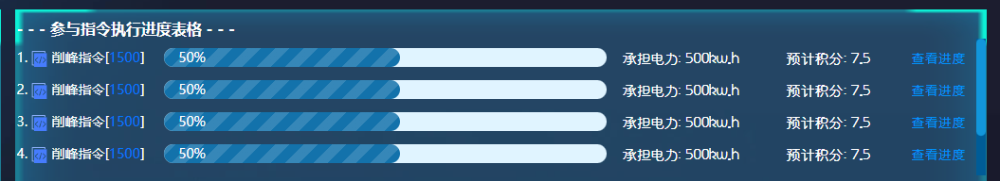
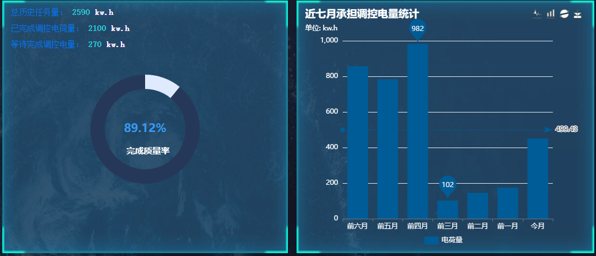
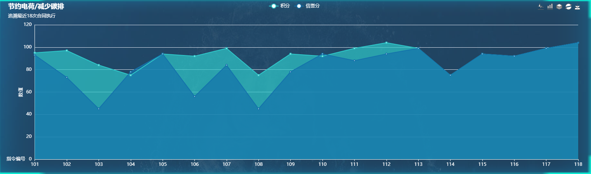
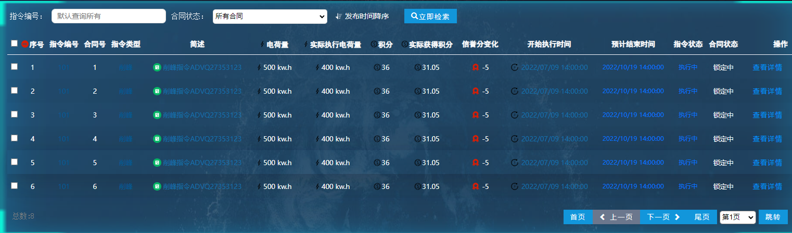

### [上海国家电网区块链前端一期 - 楼宇端](#)
`react 17.0.3` `基于 hooks 函数式编程` `sass` `webpack` `es6` `redux 状态管理` 


#### [1. 首页接口](#)

##### [1.1 /dashboard/basic](#)

`获取区块链节点的基本信息`

| `接口名称`     | `路由`             | `Method 方法` | `正确状态码` | `错误状态码`               | `说明`                             |
| -------------- | ------------------ | ------------- | ------------ | -------------------------- | ---------------------------------- |
| `首页基本信息` | `/dashboard/basic` | `GET`         | `200`        | `无参数请求 只会5XX错误。` | `获取楼宇基本信息，在线离线情况。` |

`请求参数`:`无`

`返回参数`:`用户基本信息`

```javascript
{
    radio: '在线'
    isOnline: true
    lastReportDateTime: '2022/6/02 15:40:12',//上次上报时间
    address: '成都市成华区中铁瑞城大厦1254号' //真实地址
    points: 115.2 //拥有的积分
    reputation: 102 //信誉分
    waitPoint:15 //待获得积分
    contractCount:32 //参与合同数量
}
```


##### [1.2  /dashboard/instructions](#)

`获取当前用户参与的正在执行阶段 尚未截至的指令执行进度`

| `接口名称`       | `路由`                    | `Method 方法` | `正确状态码` | `错误状态码`               | `说明`           |
| ---------------- | ------------------------- | ------------- | ------------ | -------------------------- | ---------------- |
| `获取执行中指令` | `/dashboard/instructions` | `GET`         | `200`        | `无参数请求 只会5XX错误。` | `获取当前楼宇的` |



`请求参数`:`无`

`正确返回参数 http状态码 200`

```javascript
{
     total: 4,
     data: [
         {
            type:'削峰', //指令类型
            cmdId: 123, //指令ID
            progress: 55, //进度值 表示 55%
            point: 5.74, //楼宇预计获得积分
            electricValue: 1020, //给楼宇下发的调控任务
            electricUnit: 'kw.h'
         }, /* {...},{...},{...} */
     ],
}
```

`错误返回参数`

```javascript
{
	message: "错误原因" 
}
```


##### [1.3  /direction/waiting](#)

`当前待执行的指令！`

| `接口名称`                   | `路由`               | `Method 方法` | `正确状态码` | `错误状态码`                             | `说明` |
| :--------------------------- | :------------------- | :------------ | :----------- | :--------------------------------------- | :----- |
| `需求当前待执行的指令列表！` | `/direction/waiting` | `GET`         | `200`        | `应该只会服务器错误，或者用户未登陆错误` | `....` |

`请求参数 无请求参数` :

```javascript
/* 无请求参数 */
```

`正确返回参数 http状态码 200`

```javascript
{
    length:4,
	data:[
        {
            index: 124,
            carryOutTime: "2022/07/09 14:00:00",
            codeName: "削峰指令ADVQ27353123",
            coin: "36",
            createTime: "2021/10/8 14:41:12",
            detail: "为保证核心单位[学校，食品生成,医疗单位...]....！",
            endTime: "2022/10/19 14:00:00",
            mark: "优秀",
            phone: "17754986258",
            principalName: "李越",
            rate: 7.2,
            states: "执行完毕",
            type: "削峰",
            valueElectric: 500
        },
        /*{...},{...},{...},{...},{...},{...}*/
    ]
}
```

`错误返回参数`

```javascript
{
	message: "错误原因" 
}
```


##### [1.4  /dashboard/report](#)

`上报调控能力，上报时间以服务器收到请求时间为准，需要记录！`

| `接口名称`     | `路由`               | `Method 方法` | `正确状态码` | `错误状态码` | `说明`     |
| :------------- | :------------------- | :------------ | :----------- | :----------- | :--------- |
| `出价购买接口` | ` /dashboard/report` | `POST`        | `200`        | `417`        | `选择指令` |


`请求参数`:

```javascript
{ 
    cmdId: '125'  //指令ID
    electricValue: 0 //电荷量
    electricUnit: 'kw.h' //电荷量单位
}
```

`正确返回参数`

```javascript
{
    isOK: true
}
```

`错误返回参数`

```javascript
{
    message:"什么错误啊！"
}
```


##### [1.5 /direction/progress](#)

`获得执行进度情况`

| `接口名称`           | `路由`                 | `Method 方法` | `正确状态码` | `错误状态码` | `说明`     |
| :------------------- | :--------------------- | :------------ | :----------- | :----------- | :--------- |
| ``获得执行进度情况`` | ` /direction/progress` | `GET`         | `200`        | `417`        | `选择指令` |

`请求参数`:

```javascript
{ 
    cmdId: '126' //指令Id
}
```

`正确返回参数`

```javascript
{
       progress: [
            {
                name: '指令初始化',
                state: 1, // 1 已完成 2. 执行中  3.待执行
                finishDataTime: '2022/8/3 00:00:46'
            },
            {
                name: '指令上链',
                state: 1, // 1 已完成 2. 执行中  3.待执行
                finishDataTime: '2022/8/3 00:10:46'
            },
            {
                name: '链上广播',
                state: 1, // 1 已完成 2. 执行中  3.待执行
                finishDataTime: '2022/8/3 00:20:46'
            },
            {
                name: '广播完成',
                state: 1, // 1 已完成 2. 执行中  3.待执行
                finishDataTime: '2022/8/3 05:20:46'
            },
            {
                name: '智能调度',
                state: 1, // 1 已完成 2. 执行中  3.待执行
                finishDataTime: '2022/8/3 12:12:54'
            },
            {
                name: '需求响应生成',
                state: 1, // 1 已完成 2. 执行中  3.待执行
                finishDataTime: '2022/8/3 14:12:54'
            },
            {
                name: '合同上链',
                state: 1, // 1 已完成 2. 执行中  3.待执行
                finishDataTime: '2022/8/3 16:12:54'
            },
            {
                name: '楼宇签署',
                state: 2, // 1 已完成 2. 执行中  3.待执行
                finishDataTime: '' //返回当前时间也是可以的
            },
            {
                name: '等待需求响应完成',
                state: 3, // 1 已完成 2. 执行中  3.待执行
                finishDataTime: ''
            },
            {
                name: '需求响应执行完毕',
                state: 3, // 1 已完成 2. 执行中  3.待执行
                finishDataTime: ''
            },
            {
                name: '响应结果评估',
                state: 3, // 1 已完成 2. 执行中  3.待执行
                finishDataTime: ''
            },
            {
                name: '积分发放',
                state: 3, // 1 已完成 2. 执行中  3.待执行
                finishDataTime: ''
            },
            {
                name: '信誉分发放',
                state: 3, // 1 已完成 2. 执行中  3.待执行
                finishDataTime: ''
            },
            {
                name: '指令完成',
                state: 3, // 1 已完成 2. 执行中  3.待执行
                finishDataTime: ''
            }
        ]
    })
```

`错误返回参数`

```javascript
{
    message:"什么错误啊！"
}
```


##### [1.6 /dashboard/year](#)

`获得某一年的季度统计`

| `接口名称`             | `路由`             | `Method 方法` | `正确状态码` | `错误状态码` | `说明`     |
| :--------------------- | :----------------- | :------------ | :----------- | :----------- | :--------- |
| `获得某一年的季度统计` | ` /direction/year` | `GET`         | `200`        | `417`        | `选择指令` |

`请求参数`:

```javascript
{ 
    year: 2022 //第几年
}
```

`正确返回参数`

```javascript
{
    quarterly: [
        { value: 12, name: '第一季度' },
        { value: 23, name: '第二季度' },
        { value: 5, name: '第三季度' },
        { value: 0, name: '第四季度' }
    ]
}
```

`错误返回参数`

```javascript
{
    message:"什么错误啊！"
}
```


##### [1.7 /dashboard/electric](#)

`获得电荷统计`




| `接口名称`         | `路由`                 | `Method 方法` | `正确状态码` | `错误状态码` | `说明`     |
| :----------------- | :--------------------- | :------------ | :----------- | :----------- | :--------- |
| `以上两个图表数据` | ` /dashboard/electric` | `GET`         | `200`        | `417`        | `选择指令` |

`请求参数`:`无请求参数`

`正确返回参数`

```javascript
{
     finishRate: 89.12, //表示89.12% 完成质量
     totalElectricValue: 2590, //总共得到了多少任务量
     ElectricUnit: 'kw.h',
     actualFinishElectricValue: 2100, //实际完成电荷量
     waitingFinishElectricValue: 270, //待完成电荷量
     months:['前六月', '前五月', '前四月', '前三月', '前二月', '前一月', '今月'],
     values:[ 857, 784, 982, 102, 145, 175, 451 ]
}
```

`错误返回参数`

```javascript
{
    message:"什么错误啊！"
}
```


##### [1.8 /dashboard/statistics](#)

`获得近18次指令执行后 信誉分 积分值`




| `接口名称`           | `路由`                   | `Method 方法` | `正确状态码` | `错误状态码` | `说明`     |
| :------------------- | :----------------------- | :------------ | :----------- | :----------- | :--------- |
| `获得积分信誉分统计` | ` /dashboard/statistics` | `GET`         | `200`        | `417`        | `选择指令` |

`请求参数`:`无请求参数`

`正确返回参数:`

```javascript
{
   //指令ID
   cmdIdCollection: ['101', '102', '103', '104', '105', '106', '107', '108', '109', '110','111', '112','113','114','115','116','117','118'],
   points: [95, 97, 84, 75, 94, 92, 99,75, 94, 92, 99, 104,99,75, 94, 92, 99, 104],
   reputation: [93, 73, 45, 78, 94, 56, 84, 45, 78, 94, 88, 94,99,75, 94, 92, 99, 104]
}
```

`错误返回参数`

```javascript
{
    message:"什么错误啊！"
}
```


##### [1.9 /dashboard/contracts](#)




| `接口名称`         | `路由`                   | `Method 方法` | `正确状态码` | `错误状态码` | `说明`     |
| :----------------- | :----------------------- | :------------ | :----------- | :----------- | :--------- |
| `获得合同执行历史` | `  /dashboard/contracts` | `GET`         | `200`        | `417`        | `选择指令` |

`请求参数`:

```javascript
{ 
	cmdId: '', //指令ID 空表示查询所有 输入类型是字符串 有可能收到 非数字输入
	contractState: -1, //合同状态 和之前的聚合商部分一样 如下所示
	pageIndex: 1, //第几页
	count: 6, //数量
	sortTime: 1  //  1 降序 0 升序
}
```

```javascript
//合同状态
let contractState = [
    {value: 0, name:'所有合同'},
    {value: 1, name:'签署中'},
    {value: 2, name:'锁定中'},
    {value: 3, name:'等待支付'}
];

```


`正确返回参数:`

```javascript
{
    total:14,
    data:[
        {
        	contractIndex: 2,
	        cmdId:101,
	        codeName:"削峰指令ADVQ27353123", //指令简述
    	    type:'削峰', //指令类型
        	contractCreatTime: '2022/8/2 22:09:31',
        	createTime:"2021/10/8 14:41:12", //指令创建时间
        	carryOutTime: "2022/07/09 14:00:00",//指令执行时间
        	endTime:"2022/10/19 14:00:00", //执行结束时间
        	valueElectric: 500, //合同 当前楼宇需要承担的电荷量
        	electricUnit: 'kw.h', 
        	point:"36", //给当前楼宇多少积分
        	mark:"优秀", //评价
        	contractState: '锁定中',
        	cmdStates:"执行中", //指令状态
        	actualElectricValue: 400, //实际完成量
        	actualPoint:31.05,
        	reputationChange: -5, //信誉分降低五分
        	directionDetail:"为保证核心单位[学校，食品生成,医疗单位...]供电需求，需要电力调控。请各位尽力配合，非常感谢大家的热心合作！"
        }
    ],
    pageCount: 10 //多少也
}
```


##### [1.10 /dashboard/reports](#)

`获得通报历史`

| `接口名称`     | `路由`               | `Method 方法` | `正确状态码` | `错误状态码` | `说明`     |
| :------------- | :------------------- | :------------ | :----------- | :----------- | :--------- |
| `获得上报历史` | `/dashboard/reports` | `GET`         | `200`        | `417`        | `选择指令` |

`请求参数`:

```javascript
{ 
	pageIndex: 1, //第几页
	count: 6, //数量
}
```

`正确返回参数:`

```javascript
{
    total:14,
    data:[
        {
        	reportId: 1,
        	cmdId: 124, // 指令ID
        	type:'削峰', //指令类型
        	electricValue: 500, //意愿值
        	reportDataTime: '2022/8/3 10:21:18',
        	electricUnit: 'kw.h'
        }
    ],
    pageCount: 10 //多少也
}
```

